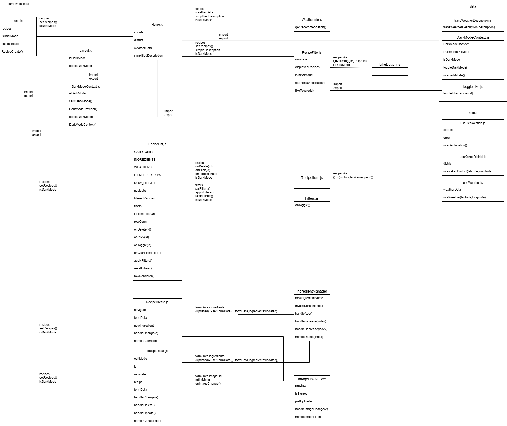
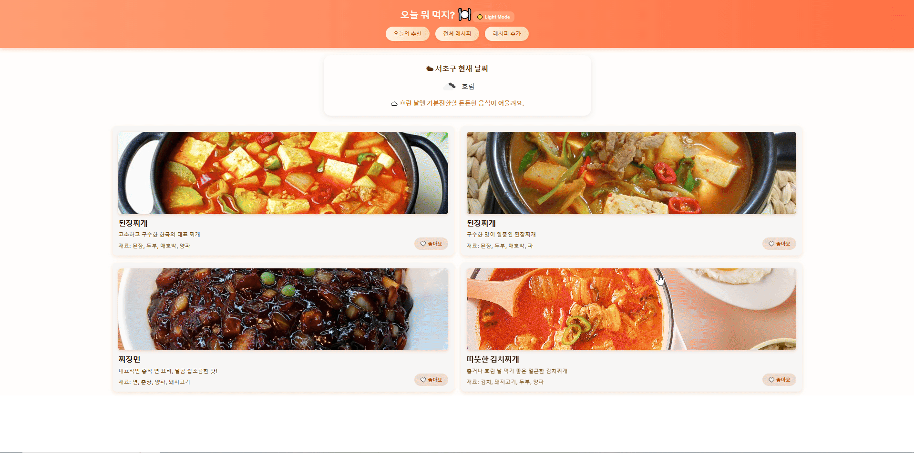

# 🍳 오늘 뭐 먹지?

> 날씨에 따라 어울리는 음식을 추천하는 React 웹 애플리케이션

---

## 🌤️ 프로젝트 개요

**프로젝트명:** 오늘 뭐 먹지?  
**개발 기간:** 2025.10.14 ~ 2025.10.20  
**팀원:** 김지원 · 박건영 · 한해찬)

### 🎯 기획 의도

기존 레시피 추천 사이트는 날씨 정보를 반영하지 못하거나,  
사용자가 **싫어하는 재료를 필터링**할 수 없다는 한계가 있었습니다.

이를 개선하기 위해 저희는

> “현재 날씨에 따라 어울리는 음식을 추천하고,  
> 개인 취향(좋아요, 싫은 재료)을 반영하는 맞춤형 레시피 앱”  
> 을 만들었습니다.

---

## ⚙️ 주요 기능

- 🌤️ **날씨 기반 음식 추천**  
  OpenWeatherMap API로 현재 날씨 정보를 받아 레시피 추천
- 🍱 **레시피 목록 표시 및 필터링**
  - 좋아하는 음식만 보기
  - 싫어하는 재료 제외
  - 날씨별 필터링
- ❤️ **좋아요(Like) 기능**
  - 각 레시피 카드에 ❤️ 버튼을 클릭하여 좋아요 토글
  - 좋아요한 레시피만 따로 모아서 볼 수 있는 **"좋아요만 보기"** 기능 제공
  - 상태는 즉시 반영되며, 필터 적용과 연동됨
- 🧾 **CRUD 기능**
  - 레시피 추가 / 수정 / 삭제
- 🧭 **SPA 라우팅 (React Router)**  
  전체 레시피 리스트, 상세 페이지, 작성 페이지 이동
- ♻️ **Lazy Loading & Suspense 적용**
- 🌙 **다크모드 지원**
- ⚡ **React Virtualized** 기반 가상 스크롤  
  (리스트 성능 최적화)

---

## Flow Chart



---

## 👩‍💻 역할 분담

| 이름       | 담당 영역                  | 주요 역할                                                                                |
| ---------- | -------------------------- | ---------------------------------------------------------------------------------------- |
| **김지원** | 레시피 리스트 페이지       | 전체 레시피 UI, 사용자 필터 기능, 좋아요 기능, 가상 스크롤, 더미데이터 제작, 스타일 통합 |
| **박건영** | 레시피 작성 및 상세 페이지 | 작성 페이지 및 상세 페이지 UI, CRUD 기능, 이미지 업로드, 수정 모드, 라우팅, UI           |
| **한해찬** | 메인(홈) 페이지            | 메인 UI, 날씨 API 연동, 지역 정보 표시, 날씨별 추천 기능, 네비게이션 바, 다크모드        |

📎 팀 프로젝트 페이지  
👉 [React Project - 5조 (Notion)](https://www.notion.so/React-Project-5-28caa939b4b3808eb6d8c6c5236f855b)

---

## 🌐 사용 API

> 사용자의 **현재 위치 좌표(lat, lon)** 를 기반으로  
> **행정구역명(시/구/동)** 과 **실시간 날씨 데이터**를 조회하여  
> **날씨에 어울리는 음식 레시피**를 추천합니다.

### 🧭 Kakao Local API

**좌표 → 행정구역명 변환**

- **사용 목적:**  
  브라우저에서 받아온 현재 위치 좌표(lat, lon)를 **행정구역명(시/구/동)** 으로 변환합니다.

- **사용 이유:**  
  사용자가 위치 접근을 허용하면, 해당 지역의 날씨와 연동하여 **맞춤 음식 추천**을 제공합니다.

- **요청 URL:**  
  `GET https://dapi.kakao.com/v2/local/geo/coord2address.json`

- **요청 헤더:**  
  `Authorization: KakaoAK {REST_API_KEY}`

- **요청 파라미터:**

  - `x`: 경도 (longitude)
  - `y`: 위도 (latitude)

- **요청 예시:**

  ```
  https://dapi.kakao.com/v2/local/geo/coord2address.json?x=126.9780&y=37.5665
  ```

- **응답 예시:**
  ```json
  {
    "documents": [
      {
        "address": {
          "region_1depth_name": "서울특별시",
          "region_2depth_name": "중구",
          "region_3depth_name": "태평로1가"
        }
      }
    ]
  }
  ```

### 🌦️ OpenWeatherMap API

**현재 위치 기반 날씨 정보 조회**

- **사용 목적:**  
  Kakao Local API로 얻은 좌표(lat, lon)를 기반으로  
  사용자의 현재 위치 날씨를 조회하고,  
  **“맑음 / 비 / 눈 / 안개 / 번개 / 바람”** 등의 상태에 따라  
  **어울리는 레시피를 추천**합니다.

- **요청 URL:**  
  `GET https://api.openweathermap.org/data/2.5/weather`

- **요청 파라미터:**

  - `lat`: 위도 (latitude)
  - `lon`: 경도 (longitude)
  - `appid`: OpenWeatherMap API Key
  - `units`: 단위 (metric = 섭씨)
  - `lang`: 언어 (예: kr)

- **요청 예시:**

  ```
  https://api.openweathermap.org/data/2.5/weather?lat=37.5665&lon=126.9780&appid={OPENWEATHER_API_KEY}&lang=kr&units=metric
  ```

- **응답 예시:**
  ```json
  {
    "weather": [
      {
        "main": "Clouds",
        "description": "흐림"
      }
    ],
    "main": {
      "temp": 19.3
    },
    "name": "Seoul"
  }
  ```

---

### ✅ 통합 사용 흐름

1. **Geolocation API**  
   → 사용자의 위치 접근 허용 시 `lat`, `lon` 좌표 수집
2. **Kakao Local API**  
   → 수집된 좌표를 통해 **행정구역명(시/구/동)** 조회
3. **OpenWeatherMap API**  
   → 동일 좌표로 **실시간 날씨 데이터** 조회
4. **React 애플리케이션**  
   → 지역명 + 날씨 데이터를 조합하여  
    **현재 날씨에 어울리는 음식 레시피 추천** 구현

---

## 🧩 기술 스택

### 🖥️ Frontend

- **React 18**
- **React Router**
- **SCSS (모듈화 스타일링)**

### ⚙️ 상태 관리 & 로직

- React **Hooks (useState, useEffect)**
- **Custom Hooks** (필터링 로직, 다크모드 등)
- **React Context** (전역 상태 관리)

### ☁️ API & 데이터

- **OpenWeatherMap API** – 실시간 날씨 정보
- **Kakao Local API** – 좌표 → 지역명 변환
- **Geolocation API** – 브라우저 위치 기반 좌표 추출
- **Dummy Data (2,500개)** – 테스트용 레시피 데이터

### 🎨 UI/UX

- **반응형 디자인 (Responsive Layout)**
- **다크모드 지원**
- **Lazy Loading / Suspense**
- **React Virtualized** (리스트 성능 최적화)

### 🧰 개발 환경

- **Node.js**
- **npm**
- **ESLint + Prettier** (코드 스타일 통일)
- **Git / GitHub** (버전 관리)

---

## 🍽️ 주요 기능 소개

이 프로젝트는 **사용자의 기호와 날씨에 따라 음식을 추천**하고,  
레시피를 직접 추가·관리할 수 있는 웹 애플리케이션입니다.

---

### 🏠 1. 메인 페이지 - 오늘의 추천

> 현재 위치의 **날씨**를 기반으로 어울리는 음식을 추천합니다.

- 사용자의 지역과 실시간 날씨 정보 연동 (`OpenWeather API`)
- 날씨에 따라 다른 문구 및 추천 레시피 출력
- 좋아요(❤️) 버튼으로 즐겨찾기 가능


---

### 🍳 2. 레시피 추가 페이지

> 사용자가 새로운 레시피를 **직접 등록**할 수 있습니다.

- 레시피 제목, 설명, 재료, 이미지 입력 가능
- 입력한 데이터는 `localStorage` 또는 DB에 저장되어 목록에 반영
- 등록 후 자동 리다이렉트 및 성공 메시지 표시



---

### 📋 3. 전체 레시피 & 필터 기능

> 등록된 모든 레시피를 **필터링 및 관리**할 수 있습니다.

- 음식 종류, 재료, 날씨별 필터 기능
- 좋아요(❤️) 필터로 즐겨찾은 레시피만 보기
- 각 카드에서 바로 삭제 및 좋아요 토글 가능


---

### 🌤️ 4. 부가 기능

- **Light / Dark 모드** 지원
  
- 반응형 UI (데스크탑 / 모바일 모두 최적화)
  

---
